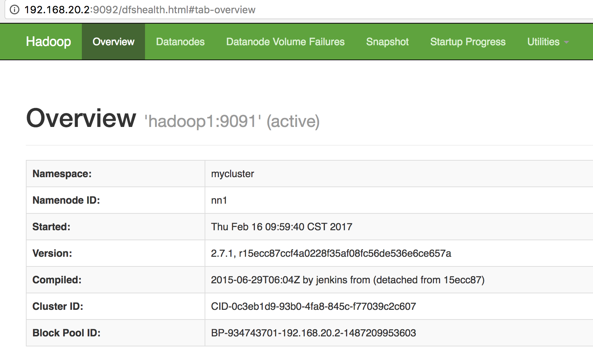
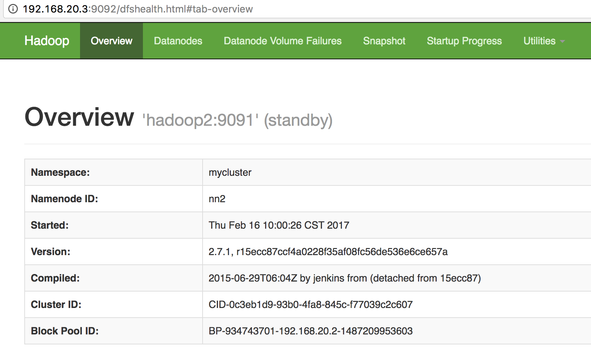
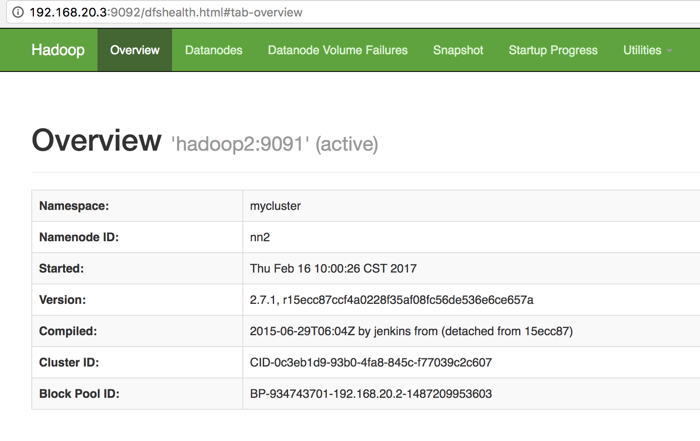

# Hadoop学习指南(HA配置)
--------

## 前言
本篇介绍Hadoop的一些常用知识。要说和网上其他manual的区别，那就是这是笔者写的一套成体系的文档，不是随心所欲而作。

HA模式，主要是将namenode及resourcemanager都变成主备两个。这里先不讨论resourcemanager，主要针对namenode。

将namenode变成可主备自动切换的，主要是通过zookeeper集群对namenode的健康状态进行监控，然后选举一个健康的namenode做active(主)的，另一个成为standby(备)。因此，保证zookeeper集群的配置是正确且不易挂掉，是HA的基石。同时，注意HA升级过程中的相关进程的启动步骤即可完成。

官网有两种配置：NFS和QJM，两者区别参见:[《HDFS v2 HA方案对比》](http://joshuasabrina.iteye.com/blog/1858448)

本文以NFS为例进行讨论。

首先声明环境：

- CentOS 6.5 64位
- Hadoop 2.7.1
- Java 1.8

所有操作均基于拥有第一代hadoop集群的环境之上。同时满足Centos 6.5系统内网络互通、机器免密码登陆、防火墙关闭。重要的是/etc/hosts文件如下：

``` 
192.168.20.2    hadoop1
192.168.20.3    hadoop2
192.168.20.4    hadoop3
192.168.20.5    hadoop4
192.168.20.6    hadoop5
```

另外，温馨提示：在hadoop的各种文件配置中，最好不要出现空格。例如：

```
<property>
	<name>ha.zookeeper.quorum</name>
	<value>hadoop2:2181,  hadoop3:2181,  hadoop4:2181</value>
</property>
```
hadoop将无法找到`  hadoop3`和`  hadoop4`这种IP。如果手贱多敲，那么将会浪费很多时间。

## 进程功能介绍

zk:维护共享锁保证只有一个active的namenode

journalnode：在两个nn间同步元数据


## 配置zookeeper集群
该集群最少需要3台机器（用于选举）。下面详述配置过程。

假设1： 3台机器是这样：

| IP | 标识 |
| ------| ------ | 
| 192.168.20.3 | hadoop2 |
| 192.168.20.4 | hadoop3 |
| 192.168.20.5 | hadoop4 |

假设2： 下载完的zookeeper源码包位于：/home/deploy/zookeeper-3.4.9。

假设3：java环境为1.8版本，位于：/home/deploy/jdk1.8.0_111。

第一步，配置zoo.cfg:
`vi /home/deploy/zookeeper-3.4.9/conf/zoo.cfg`

修改配置:

```
# The number of milliseconds of each tick
tickTime=2000

# The number of ticks that the initial
# synchronization phase can take
initLimit=10

# The number of ticks that can pass between
# sending a request and getting an acknowledgement
syncLimit=5

# the directory where the snapshot is stored.
# do not use /tmp for storage, /tmp here is just
# example sakes.
dataDir=/home/deploy/zookeeper-3.4.9/data

# logs dir
dataLogDir=/home/deploy/zookeeper-3.4.9/logs

# the port at which the clients will connect
clientPort=2181

server.1=hadoop3:2888:3888
server.2=hadoop4:2888:3888
server.3=hadoop2:2888:3888
```

第二步，配置myid文件

在zoo.cfg中dataDir路径：dataDir=/home/deploy/zookeeper-3.4.9/data下，新建myid文件。`vi myid`
在hadoop3的机器上，该文件内容为1，
hadoop4机器上，该文件内容为2，
hadoop5机器上，该文件内容为3。内容应保持同zoo.cfg中的server.x的x值相同

第三步，开/关zookeeper集群：

开：`sh /home/deploy/zookeeper-3.4.9/bin/zkServer.sh start`

关：`sh /home/deploy/zookeeper-3.4.9/bin/zkServer.sh stop`

请在将三台机器全部开启后，查看状态：`zkServer.sh status`。

## 配置core-site.xml
在原文件上进行添加:

```
<!-- 指定hdfs的nameservice为h01，需与dfs.nameservices一致 -->
 
<property>
     <name>fs.defaultFS</name>
     <value>hdfs://mycluster</value>
</property>

<!-- 指定zookeeper地址 --> 
<property>
    <name>ha.zookeeper.quorum</name>
    <value>hadoop2:2181,hadoop3:2181,hadoop4:2181</value>
</property>
```

## 配置hdfs-site.xml
这里有两步，第一步是删除关于secondary namenode的配置，第二步是添加HA的配置。

删：

```
<!-- 以下3个 property 的配置，是非HA模式下的，即一个集群只有一个namenode，在这里不可使用 -->  
<property>
	<name>dfs.http.address</name>
	<value>h01.vm.com:50070</value>
	<description>Secondary get fsimage and edits via dfs.http.address</description>
</property>

<property>
	<name>dfs.secondary.http.address</name>
	<value>h02.vm.com:50090</value>
</property>

<property>
	<name>dfs.namenode.checkpoint.dir</name>
	<value>/home/vagrant/VMBigData/hadoop/data/namesecondary</value>
</property> 
```

添：

```
<!-- 命名空间的逻辑名称 --> 
<property>
    <name>dfs.nameservices</name>
    <value>mycluster</value>
</property>

<!-- 命名空间中所有NameNode的唯一标示。该标识指示DataNode集群中有哪些NameNode -->  
<property>
    <name>dfs.ha.namenodes.mycluster</name>
    <value>nn1,nn2</value>
</property>
<property>
    <name>dfs.namenode.rpc-address.mycluster.nn1</name>
    <value>hadoop1:9091</value>
</property>
<property>
    <name>dfs.namenode.rpc-address.mycluster.nn2</name>
    <value>hadoop2:9091</value>
</property>
<property>
    <name>dfs.namenode.http-address.mycluster.nn1</name>
    <value>hadoop1:9092</value>
</property>
<property>
    <name>dfs.namenode.http-address.mycluster.nn2</name>
    <value>hadoop2:9092</value>
</property>

<!-- JournalNode URLs，ActiveNameNode 会将 Edit Log 写入这些 JournalNode 所配置的本地目录即 dfs.journalnode.edits.dir -->  
<property>
    <name>dfs.namenode.shared.edits.dir</name>
    <value>qjournal://hadoop2:8485;hadoop3:8485;hadoop4:8485/mycluster</value>
</property>

<!-- JournalNode 用于存放 editlog 和其他状态信息的目录 -->
<property>
    <name>dfs.journalnode.edits.dir</name>
    <value>/home/deploy/hadoop-2.7.1/journaldata</value>
</property>
<property>
    <name>dfs.ha.automatic-failover.enabled</name>
    <value>true</value>
</property>
<property>
    <name>dfs.client.failover.proxy.provider.mycluster</name> 
<value>org.apache.hadoop.hdfs.server.namenode.ha.ConfiguredFailoverProxyProvider</value>
</property>

<!-- 一种关于 NameNode 的隔离机制(fencing) -->  
<property>
	<name>dfs.ha.fencing.methods</name>
	<value>
		sshfence
		shell(/bin/true)
	</value>
</property>
<property>
	<name>dfs.ha.fencing.ssh.private-key-files</name>
	<value>/home/deploy/.ssh/id_rsa</value>
</property>
<property>
	<name>dfs.ha.fencing.ssh.connect-timeout</name>
	<value>30000</value>
</property>
```

## 修改slaves文件
主要是把作为namenode节点的ip从该文件中删除，视各自机器环境而定。


## 启动HA集群
启动顺序，非常讲究。。。

重要的一点：不容许使用 hdfs namenode -format的命令，此命令会删除原集群的所有数据。

第一步，先关所有的集群进程。

第二步，打开zookeeper集群：sh /home/deploy/zookeeper-3.4.9/bin/zkServer.sh start

第三步，打开journalnode进程，该进程在两个nn间同步元数据。在hadoop2\3\4上都执行：
sh hadoop-daemon.sh start journalnode

第四步，在原namenode节点上执行：sh hadoop-daemon.sh start namenode。
此操作会将namenode状态变成active。

第五步，在备（standby）节点执行同步namenode数据的命令：hdfs namenode -bootstrapStandby。
切记不要使用scp的方式同步元数据，会导致文件权限问题。

第六步，启动备namendoe：sh hadoop-daemon.sh start namenode

第七步，初始化zkfc。在主备两台上任意一台执行：hdfs zkfc -formatZK

第七步，启动zk(DFSZKFailoverController)，该进程维护共享锁保证只有一个active的namenode。分别在两台作为NN的节点上执行：sh hadoop-daemon.sh start zkfc

第八步，启动hdfs集群（就是打开所有的datanode进程）：sh start-dfs.sh

第九步，打开没有任何变化的yarn：sh start-yarn.sh。上面说了暂时不讨论resourcemanger的升级。

至此，hadoop集群双NN的升级就完成了。

## 效果展示
第一步， 打开两个NN的监控页：





第二步：kill hadoop1的namenode进程，查看hadoop2中namenode的状态由standby变为active：

重复几次，主备仍能自切。

## 参考资料

- [官方文档: HDFS High Availability](http://hadoop.apache.org/docs/r2.7.1/hadoop-project-dist/hadoop-hdfs/HDFSHighAvailabilityWithNFS.html#Hardware_resources)
- [官方文档: ResourceManager High Availability](https://hadoop.apache.org/docs/r2.7.1/hadoop-yarn/hadoop-yarn-site/ResourceManagerHA.html)
- [Hadoop NameNode 高可用 (High Availability) 实现解析](https://www.ibm.com/developerworks/cn/opensource/os-cn-hadoop-name-node/)
- [Hadoop的HA机制(Zookeeper集群+Hadoop集群)配置记录](http://blog.csdn.net/dingchenxixi/article/details/51131493)
- [hadoop HA高可用集群模式搭建指南](http://www.jianshu.com/p/8a8fb958f11f)	
- [Journal Storage Directory not formatted](http://blog.csdn.net/knowledgeaaa/article/details/23759099)