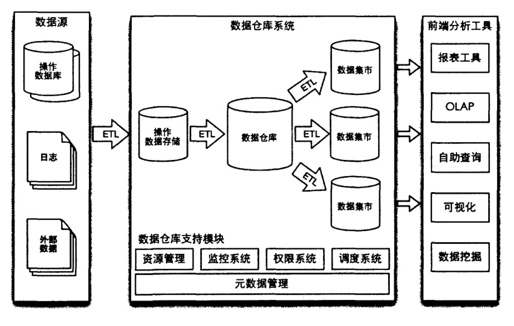

# 数据仓库学习(概念篇)
--------

## 前言
本篇介绍数据仓库（DW）的一些常用知识。要说和网上其他manual的区别，那就是这是笔者写的一套成体系的文档，不是随心所欲而作。

## 典型架构

## 基本概念

- 数据仓库

>数据仓库是一个面向主题的、集成的、非易失的（nonvolatile）、随时间变化的（time-variant）用来支持管理人员决策的数据集合。

>----William H.Inmon

以上也是数据仓库区别于业务系统的4个特征。

- OLAP

联机分析处理（On-line Analytical Processing），该概念由数据库创始人E. F. Codd于1993年提出。OLAP理事会（OLAP Council）进一步完善：OLAP是一种软件技术，它使分析人员、经理和执行官能够迅速、一致、交互的从各方面观察信息，以达到深入理解数据的目的。

- OLTP

联机事务处理（On-line Transaction Processing）

- ODS 

操作数据存储（Operational Data Store, 简称ODS）。在数据仓库系统中，ODS存储了原始数据经过集成统一后的数据。

- DW

数据仓库（Data Warehouse，简称DW）。在数据仓库系统中，DW数据库存储了整个企业的所有历史数据，是狭义上的数据仓库。DW数据库需要满足企业数据分析的各种需求，以及各个部门建设数据集市的需求，通常存储企业的基础数据和通用数据。

- 数据集市(Data Market)

数据集市是指针对特定部门和主题的小型数据仓库，数据从DW中获取。

- ETL

ETL（Extract，Transform，Load）表示抽取、转换和装载，数据从多个同构或异构的数据源抽取出来，经过自定义的转换操作，最终装载进入目标表的过程叫做一次ETL。ETL是数据进入ODS、DW、Data Market的主要方式。

## 建模方法

- 维度建模法（Dimensional Modeling）

Ralph Kimball主张，

- 实体-关系建模（Entity-Relationship Medeling）

实体-关系建模也叫做第三范式建模（Third Normal Form, 3NF）,是William H.Inmon主张的一种数据仓库建模方法。

## 参考资料

- [hadoop HDFS常用文件操作命令](https://segmentfault.com/a/1190000002672666)
- [HDFS 文件操作命令](http://book.51cto.com/art/201409/452359.htm)

